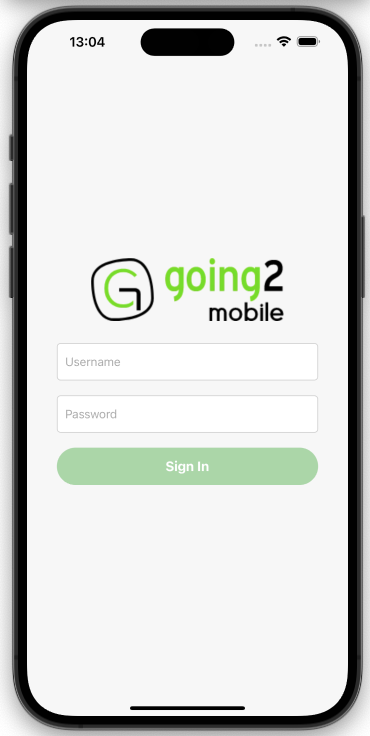

# Going2 SignIn Example

Este é um projeto de exemplo de página de SignIn. O projeto foi construído usando React Native e TypeScript.

## Telas do Aplicativo

### Tela de SignIn



### Tela de Welcome


## Características

- **SignIn Screen**: Uma tela de login onde os usuários podem inserir suas credenciais.
- **Welcome Screen**: Uma tela de boas-vindas exibida após um login bem-sucedido.
- **Authentication Context**: Gerenciamento do estado de autenticação através do contexto do React.
- **Validação de Credenciais**: Checagem das credenciais de usuário antes de permitir o acesso.
- **Feedback de Usuário**: Mensagens de erro para falhas de login.

## Início Rápido

Para rodar o projeto, siga os passos abaixo:

1. Clone o repositório para sua máquina local

2. Navegue até a pasta do projeto e instale as dependências:

```bash
yarn install
```

3. Inicie o servidor Metro:

```bash
yarn start
```

4. Em um novo terminal, rode a aplicação no emulador/dispositivo:

```bash
yarn android
# ou
yarn ios
```

## Estrutura do Projeto

```
react-native-sign-in-example/
├── src/
│   ├── screens/         # Telas do SignIn e Welcome
│   ├── context/         # Contexto de autenticação
│   └── assets/          # Ativos como imagens e logos
├── App.tsx              # Componente raiz do aplicativo
└── README.md            # Documentação do projeto
```

## Usuários de Teste

O aplicativo possui um conjunto de usuários fixos (hardcoded) para fins de teste e demonstração. Esses usuários são usados para simular o processo de autenticação. Abaixo estão as credenciais desses usuários de teste:

| Username | Password   |
|----------|------------|
| user1    | password1  |
| user2    | password2  |

Para realizar o login no aplicativo, utilize uma das combinações de nome de usuário e senha listadas acima. Esses usuários são parte da simulação de autenticação e são usados apenas para demonstrar o funcionamento do processo de login.
